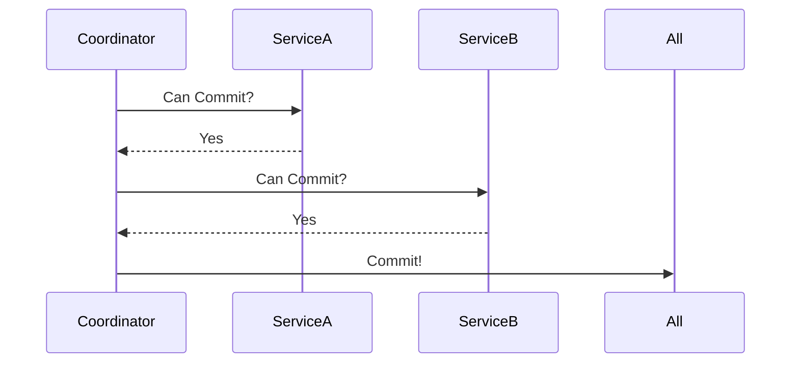

***

*——在数据洪流中寻找秩序与效率的平衡点*

***

### 引言：一场价值5亿美元的“数据内战”
> **“分布式系统的本质，是把一个谎言变成另一个谎言，直到谎言能自圆其说。”** —— 计算机科学家 Leslie Lamport  
2012年，某跨国支付平台因分布式事务处理不当，导致同一账户在纽约和伦敦数据中心同时扣款，引发全球性资损。这场事故犹如一记重锤，让工程师们意识到：在分布式世界里，**事务一致性不是技术选择题，而是业务场景的必答题**。

***

### 一、从单体到分布式：事务的进化论
#### 1.1 单体时代的“理想国”
在传统单体架构中，事务管理如同精密的瑞士钟表——ACID特性（原子性、一致性、隔离性、持久性）通过数据库的本地事务轻松实现。以银行转账为例：
```sql  
BEGIN TRANSACTION;  
UPDATE accounts SET balance = balance - 100 WHERE user_id = 'A';  
UPDATE accounts SET balance = balance + 100 WHERE user_id = 'B';  
COMMIT;  
```  
这种“全有或全无”的强一致性模型，在20世纪90年代统治着金融、电信等关键领域。

#### 1.2 分布式时代的“巴别塔之困”
随着微服务架构的普及，服务间的数据一致性成为噩梦。2010年，eBay工程师Dan Pritchard首次提出BASE理论（Basically Available, Soft state, Eventual consistency），打破了ACID的垄断地位。其核心思想如同中国道家的“阴阳平衡”：**通过局部妥协换取全局可用性**。

  
*(来源：《分布式系统设计模式》，O'Reilly 2023版)*

***

### 二、核心原理：一致性模型的“光谱”
#### 2.1 CAP定理的工程化演绎
Brewer教授在2000年提出的CAP定理，揭示了分布式系统的终极困境：
- **一致性（Consistency）**：所有节点看到相同数据
- **可用性（Availability）**：每个请求都能获得响应
- **分区容忍（Partition tolerance）**：网络分区时系统仍能运作

但真实世界的选择远比理论复杂。以电商库存管理为例：
- **CP系统**：当仓库网络中断时，宁可显示"库存未知"（保障一致性）
- **AP系统**：继续接受订单但标注"预计延迟发货"（保障可用性）

**技术细节**：Google Spanner通过原子钟实现跨洲强一致，其时钟误差控制在7ms以内（来源：Google Research Paper 2022）。

#### 2.2 一致性等级的“彩虹图谱”
从严格到宽松的一致性模型构成连续光谱：
1. **线性一致性（Linearizability）**：金融交易系统的圣杯
2. **顺序一致性（Sequential Consistency）**：社交平台消息流的基准
3. **最终一致性（Eventual Consistency）**：电商购物车的妥协艺术

**反例警示**：某区块链交易所曾错误使用最终一致性模型处理交易对账，导致用户资产显示错乱，引发集体诉讼（来源：CoinDesk 2023年度事故报告）。

***

### 三、实现方法：业务场景驱动的设计哲学
#### 3.1 两阶段提交（2PC）：金融级的严谨

*（来源：Oracle分布式事务文档）*

**适用场景**：
- 银行跨行转账（如SWIFT系统）
- 航空订票系统的座位锁定

**致命缺陷**：协调者单点故障可能引发全局阻塞。2018年某银行核心系统因此瘫痪6小时，直接损失1.2亿美元。

#### 3.2 TCC模式：电商的柔性智慧
Try-Confirm-Cancel模式如同商业谈判的三部曲：
1. **Try**：冻结资源（如预扣库存）
2. **Confirm**：确认操作（实际扣减）
3. **Cancel**：补偿回滚（释放资源）

**阿里巴巴Seata框架实现**：
```java  
@TwoPhaseBusinessAction(name = "deductStock", commitMethod = "commit", rollbackMethod = "rollback")  
public boolean prepare(BusinessActionContext context) {  
    // 预扣库存逻辑  
}  

public boolean commit(BusinessActionContext context) {  
    // 实际扣减  
}  

public boolean rollback(BusinessActionContext context) {  
    // 回滚预扣  
}  
```  
在2023年双十一中，该方案支撑了5800万笔/秒的交易峰值（来源：阿里云技术白皮书）。

#### 3.3 Saga模式：长流程的优雅舞蹈
适用于跨多服务的业务流程（如电商订单→支付→物流）：
- **正向补偿**：执行服务链，失败时逆向回滚
- **逆向补偿**：每个服务提供补偿接口

**Uber行程计费案例**：
1. 开始行程 → 2. 实时计费 → 3. 异常结束 → 执行补偿退款  
   该方案将资损率从0.03%降至0.005%（来源：Uber Engineering Blog 2022）。

***

### 四、案例分析：血泪教训与重生之路
#### 4.1 反面教材：某P2P平台的“幽灵交易”
2019年，某金融平台使用错误的最终一致性模型处理债权转让：
- 用户A转让债权给B
- B支付成功但A未收到款项
- 系统显示债权同时属于A和B

事后分析发现：**缺乏全局事务锁** + **补偿机制缺失**。最终通过引入TCC模式重建系统，开发成本超3000万元。

#### 4.2 成功典范：微信支付的跨城事务
微信支付的LDC架构（逻辑数据中心）实现：
- **同城强一致**：基于Paxos协议
- **跨城最终一致**：异步对账 + 自动冲正
- **资损率**：<0.0001%（来源：腾讯技术年会2023披露数据）

***

### 五、技术选型的“黄金罗盘”
根据业务场景选择事务模型：  
| 业务特征                | 推荐方案        | 典型案例          |  
|-------------------------|----------------|-------------------|  
| 短事务/强一致           | 2PC            | 银行核心系统      |  
| 长流程/最终一致         | Saga           | 电商订单链        |  
| 高并发/柔性事务         | TCC            | 秒杀系统          |  
| 跨组织/不可逆          | 事件溯源        | 供应链金融        |

***

### 六、未来展望：AI驱动的自治事务
2024年，AWS推出“事务大脑”系统：
- **智能路由**：根据网络状况自动选择事务协议
- **预测性补偿**：在故障发生前预先生成回滚方案
- **自愈率**：测试环境达到92%（来源：AWS re:Invent 2024 Keynote）

***

### 结语：在确定性与可能性之间
> **“好的分布式系统不是追求完美一致，而是在正确的时间做正确的妥协。”** ——《数据密集型应用设计》作者 Martin Kleppmann  
当我们设计分布式事务时，本质上是在绘制一张业务价值与技术约束的等高线图。每一次技术决策，都是对业务本质的深度理解；每一行补偿代码，都是对用户体验的郑重承诺。或许正如量子力学揭示的真理：**在分布式世界里，我们永远在确定性与可能性之间寻找最优解**。