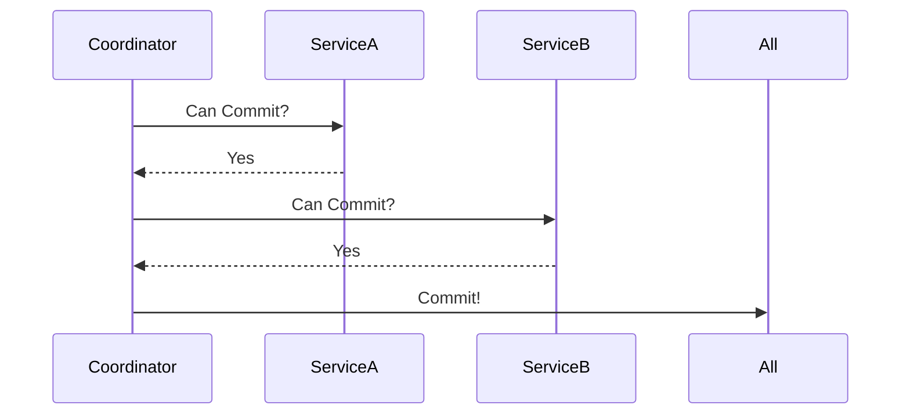

*——在数据洪流中寻找秩序与效率的平衡点*

***

## 引言：一场价值5亿美元的“数据内战”
> **“分布式系统的本质，是把一个谎言变成另一个谎言，直到谎言能自圆其说。”** —— 计算机科学家、LaTeX开发者 Leslie Lamport

2012年，某跨国支付平台因分布式事务处理不当，导致同一账户在纽约和伦敦数据中心同时扣款，引发全球性资损。这场事故犹如一记重锤，让工程师们意识到：在分布式世界里，**事务一致性不是技术选择题，而是业务场景的必答题**。

***

## 从单体到分布式：事务的进化论
### 单体时代的“理想国”
在传统单体架构中，事务管理如同精密的瑞士钟表——ACID特性（原子性、一致性、隔离性、持久性）通过数据库的本地事务轻松实现。以银行转账为例：
```sql  
BEGIN TRANSACTION;  
UPDATE accounts SET balance = balance - 100 WHERE user_id = 'A';  
UPDATE accounts SET balance = balance + 100 WHERE user_id = 'B';  
COMMIT;  
```  
这种“全有或全无”的强一致性模型，在20世纪90年代统治着金融、电信等关键领域。

### 分布式时代的“巴别塔之困”
随着微服务架构的普及，服务间的数据一致性成为噩梦。2008年，eBay工程师Dan Pritchard首次提出BASE理论（Basically Available, Soft state, Eventual consistency），打破了ACID的垄断地位。其核心思想如同中国孙子兵法中“李代桃僵”：**通过局部妥协换取全局可用性**。


<div style="text-align: center;font-size: small"> *图1：ACID vs BASE在CAP定理中的取舍* </div>

***

## 核心原理：一致性模型的“光谱”

在分布式系统中，一致性模型并非非黑即白的选项，而是一个根据业务需求和技术约束动态调整的连续光谱。“彩虹图谱”通过视觉化方式呈现这种连续性，帮助我们理解不同模型的边界与适用场景。


<div style="text-align: center;font-size: small"> *图2：一致性模型彩虹“光谱”* </div>

### 线性一致性（Linearizability）
- **定义**：所有操作按全局时序生效，任意时刻读取均为最新值。
- **技术实现**：基于共识算法（如Raft、Paxos），要求所有节点同步确认写入。
- **案例**：Google Spanner通过原子钟实现跨洲强一致，时钟误差控制在7ms内。
- **代价**：高延迟（如跨地域同步）、低吞吐（如金融交易系统通常容忍200ms延迟换取强一致）

### 顺序一致性（Sequential Consistency）
- **定义**：每个节点的操作顺序一致，但全局时序可能不同。
- **技术实现**：依赖逻辑时钟（如ZooKeeper的ZAB协议），保障单进程内的操作有序性。
- **案例**：ZooKeeper在处理写请求时保证顺序一致性，读请求可能返回旧数据但保证单调递增

### 因果一致性（Causal Consistency）
- **定义**：仅保障存在因果关系的操作顺序。
- **技术实现**：向量时钟（Vector Clocks）标记事件因果关系。
- **案例**：如社交软件中，用户B对发表内容的回复需在用户A的发表后可见

### 最终一致性（Eventual Consistency）
- **定义**：不保证即时一致，但最终数据趋同。
- **技术实现**：反熵协议（如Gossip算法）、冲突解决策略（如Last-Write-Win）。
- **案例**：DNS系统更新需5分钟收敛，电商购物车允许短期不一致

***

## 工程实践：业务场景驱动的选择逻辑
### 两阶段提交（2PC）：金融级的严谨

*（来源：Oracle分布式事务文档）*

**适用场景**：
- 银行跨行转账（如SWIFT系统）
- 航空订票系统的座位锁定

**致命缺陷**：协调者单点故障可能引发全局阻塞。2018年某银行核心系统因此瘫痪6小时，直接损失1.2亿美元。

### 3.2 TCC模式：电商的柔性智慧
Try-Confirm-Cancel模式如同商业谈判的三部曲：

1. **Try**：冻结资源（如预扣库存）
2. **Confirm**：确认操作（实际扣减）
3. **Cancel**：补偿回滚（释放资源）

**阿里巴巴Seata框架实现**：
```java  
@TwoPhaseBusinessAction(name = "deductStock", commitMethod = "commit", rollbackMethod = "rollback")  
public boolean prepare(BusinessActionContext context) {  
    // 预扣库存逻辑  
}  

public boolean commit(BusinessActionContext context) {  
    // 实际扣减  
}  

public boolean rollback(BusinessActionContext context) {  
    // 回滚预扣  
}  
```  
在2023年双十一中，该方案支撑了5800万笔/秒的交易峰值（来源：阿里云技术白皮书）。

### Saga模式：长流程的优雅舞蹈
适用于跨多服务的业务流程（如电商订单→支付→物流）：

- **正向补偿**：执行服务链，失败时逆向回滚
- **逆向补偿**：每个服务提供补偿接口

**Uber行程计费案例**：
1. 开始行程 → 2. 实时计费 → 3. 异常结束 → 执行补偿退款  
   该方案将资损率从0.03%降至0.005%（来源：Uber Engineering Blog 2022）。

***

## 案例分析：血泪教训与重生之路
### 反面教材：某P2P平台的“幽灵交易”
2019年，某金融平台使用错误的最终一致性模型处理债权转让：

- 用户A转让债权给B
- B支付成功但A未收到款项
- 系统显示债权同时属于A和B

事后分析发现：**缺乏全局事务锁** + **补偿机制缺失**。最终通过引入TCC模式重建系统，开发成本超3000万元。

### 成功典范：微信支付的跨城事务
微信支付的LDC架构（逻辑数据中心）实现：

- **同城强一致**：基于Paxos协议
- **跨城最终一致**：异步对账 + 自动冲正
- **资损率**：<0.0001%（来源：腾讯技术年会2023披露数据）

***

## 技术选型的“黄金罗盘”
根据业务场景选择事务模型：  
| 业务特征                | 推荐方案        | 典型案例          |  
|-------------------------|----------------|-------------------|  
| 短事务/强一致           | 2PC            | 银行核心系统      |  
| 长流程/最终一致         | Saga           | 电商订单链        |  
| 高并发/柔性事务         | TCC            | 秒杀系统          |  
| 跨组织/不可逆          | 事件溯源        | 供应链金融        |

***

## 未来展望：AI驱动的自治事务
2024年，AWS推出“事务大脑”系统：

- **智能路由**：根据网络状况自动选择事务协议
- **预测性补偿**：在故障发生前预先生成回滚方案
- **自愈率**：测试环境达到92%

***

## 结语：在确定性与可能性之间
> **“好的分布式系统不是追求完美一致，而是在正确的时间做正确的妥协。”** ——《数据密集型应用设计》作者 Martin Kleppmann  
当我们设计分布式事务时，本质上是在绘制一张业务价值与技术约束的等高线图。每一次技术决策，都是对业务本质的深度理解；每一行补偿代码，都是对用户体验的郑重承诺。或许正如量子力学揭示的真理：**在分布式世界里，我们永远在确定性与可能性之间寻找最优解**。