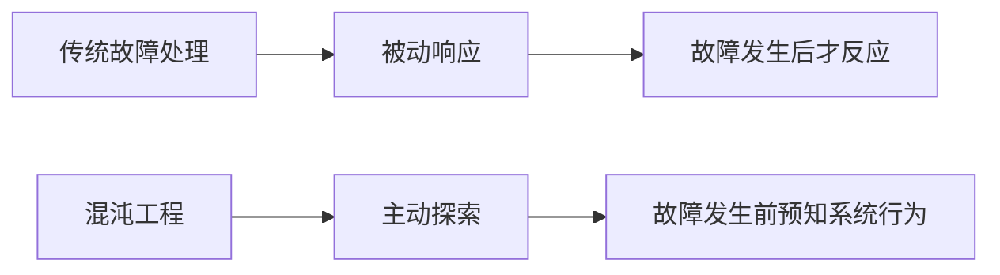

***
**"你必须先接受失败，才能从中学习。"——约翰·C·马克斯维尔**

***

## 为什么我们需要主动制造故障？

想象一下，你正在驾驶一架高速飞行的客机。你会等到雷雨天气突然降临时才测试飞机的抗干扰能力吗？显然不会。同样，在分布式系统领域，等待故障自然发生就像等待风暴降临而不做任何飞行测试。

传统的高可用设计思路是"防御式"的——我们构建冗余、实施监控、设计熔断机制，希望系统能在故障发生时存活下来。但混沌工程采用了一种截然不同的哲学：**主动式故障探索**。它承认分布式系统本质上具有不确定性，与其假装能够预防所有故障，不如学会如何与故障共处。



## 混沌工程的核心原则

混沌工程不是随机的"破坏性测试"，而是一门严谨的科学实验方法。它遵循四个核心原则：

1. **定义稳定状态**：首先需要明确系统正常运行的指标（如吞吐量、延迟、错误率）
2. **假设稳态持续**：在实验组和对照组中都期望稳态持续
3. **引入现实变量**：模拟真实世界中可能发生的故障事件
4. **最小化爆炸半径**：控制实验影响范围，避免造成真正的中断

我最喜欢的一个比喻是：混沌工程就像**系统的消防演习**。你不会为了测试大楼的防火安全而真的放火烧掉整栋建筑，而是设计受控的演练，检验 evacuation 流程是否有效。

##  Netflix的Simian Army：混沌猴与它的朋友们

Netflix开源的Simian Army工具集是混沌工程的经典实现。其中最著名的是"混沌猴"（Chaos Monkey），它随机终止生产环境中的实例，确保系统能够容忍节点故障而不影响服务。

但混沌猴只是开始。Netflix还开发了：

- **延迟猴**（Latency Monkey）：引入网络延迟，模拟服务间通信问题
- **一致性猴**（Conformity Monkey）：查找不符合最佳实践的实例
- **医生猴**（Doctor Monkey）：检查实例健康状况并移出不健康的节点
- **安全猴**（Security Monkey）：识别安全漏洞和证书过期问题

> “在分布式系统中，故障不是例外而是常态。”——Werner Vogels，亚马逊CTO

这些工具共同组成了一个完整的故障测试生态系统，确保Netflix系统能够应对各种异常情况。

## 混沌工程实践指南

### 1. 从小处开始

如果你刚刚开始引入混沌工程，不要一开始就尝试模拟整个数据中心宕机。从最可能发生的故障开始，比如：

- 单台服务器故障
- 网络延迟增加
- 磁盘空间不足
- DNS故障

### 2. 自动化实验流程

混沌工程不应该是一次性的手动测试，而应该是自动化、定期执行的流程。以下是一个简单的混沌实验框架：

```go
// 伪代码示例：简单的混沌实验框架
type ChaosExperiment struct {
    Name        string
    Hypothesis  string
    Method      func() error
    Rollback    func() error
    Metrics     []string
    Thresholds  map[string]float64
}

func runExperiment(exp ChaosExperiment) error {
    // 1. 记录初始状态
    initialMetrics := recordMetrics(exp.Metrics)
    
    // 2. 执行实验
    if err := exp.Method(); err != nil {
        return fmt.Errorf("experiment execution failed: %v", err)
    }
    
    // 3. 等待系统稳定
    time.Sleep(experimentDuration)
    
    // 4. 记录实验后状态
    postExperimentMetrics := recordMetrics(exp.Metrics)
    
    // 5. 验证假设
    if !verifyHypothesis(initialMetrics, postExperimentMetrics, exp.Thresholds) {
        // 6. 如有必要，执行回滚
        if err := exp.Rollback(); err != nil {
            return fmt.Errorf("rollback failed: %v", err)
        }
        return fmt.Errorf("hypothesis disproved")
    }
    
    return nil
}
```

### 3. 测量，测量，再测量

没有测量的混沌实验只是盲目的破坏。在运行任何实验前，确保你有完善的监控和指标收集系统。关键指标包括：

- 业务指标（交易量、成功率、收入影响）
- 系统指标（CPU、内存、磁盘I/O、网络流量）
- 应用指标（请求延迟、错误率、队列长度）

## 真实世界案例：AWS的故障注入实践

亚马逊AWS通过FIS（Fault Injection Simulator）服务将混沌工程产品化。他们的实践表明，混沌工程不仅能提高系统韧性，还能显著降低平均恢复时间（MTTR）。

在一次案例中，AWS团队对他们的S3存储服务注入了控制延迟的故障，发现了一个意想不到的级联效应：延迟增加导致客户端重试增加，进而导致更大的延迟峰值。这个发现帮助他们改进了客户端的重试逻辑，避免了潜在的雪崩效应。


*来源：AWS官方文档*

## 混沌工程的挑战与局限

虽然混沌工程威力强大，但也面临一些挑战：

1. **文化阻力**：许多人难以接受主动制造故障的想法
2. **技能要求**：需要深入的系统知识和监控能力
3. **成本问题**：实验可能需要额外的基础设施资源
4. **安全风险**：不当的实验可能造成真实的中断

为了克服这些挑战，建议采取渐进式方法：

1. 首先在开发环境中开始实践
2. 获得管理层的支持和理解
3. 从小规模、低风险的实验开始
4. 建立自动化的安全机制和回滚流程
5. 广泛分享实验结果和学到的教训

## 混沌工程的未来：AI与自适应系统

混沌工程正在向更智能的方向发展。未来的趋势包括：

- **AI驱动的混沌实验**：使用机器学习自动生成最有效的故障场景
- **自适应韧性**：系统能够根据混沌实验结果自动调整配置参数
- **混沌工程即代码**：将实验定义为代码，实现版本控制和重复执行

## 结语：拥抱不确定性

混沌工程本质上是一种谦卑的实践——它承认我们无法预测所有故障模式，但可以通过持续实验来增强系统的韧性。正如古希腊哲学家赫拉克利特所说："**万物皆流，无物常驻**"。在分布式系统的世界里，变化和故障是永恒不变的真理。

通过混沌工程，我们不再试图构建"永不故障"的系统（这是不可能的），而是构建能够**优雅应对故障**的系统。这种思维转变，正是高可用性设计的最高境界。

开始你的混沌工程之旅吧！从小处着手，测量一切，最重要的是——始终保持对故障的敬畏和好奇。